# AWSGuardDuty-KMS-S3-Splunk-Pipeline
This project demonstrates how to build a secure, scalable pipeline to export AWS GuardDuty findings to an S3 bucket encrypted with AWS KMS and ingest them into Splunk for monitoring and analysis

---

## Architecture

GuardDuty → KMS → S3 → Splunk Add-on → Splunk

---

## Step-by-Step Implementation

## Task 1: Enable GuardDuty

* Go to AWS Console → GuardDuty
* Click **Enable GuardDuty**
* Select region
* Generate **Sample Findings** for testing

---

## Task 2: Create KMS Key for Encryption

* Go to AWS Console → KMS
* Click **Create Key**
* Select **Symmetric**
* Alias: `guardduty-exports-key`
* Define admin permissions
* Skip usage permissions (will update later)
* Save and copy **Key ARN**

---

## Task 3: Create S3 Bucket

* Go to S3 → Create Bucket
* Name: `guardduty-findings-prod1509`
* Region: same as GuardDuty
* Block public access
* Enable versioning (optional)
* Enable **KMS encryption** using created key

---

## Task 4: Create IAM User for Splunk

* IAM → Users → Create User
* Name: `splunk-s3-guardduty-reader`
* Enable programmatic access
* Create access key (save securely)

---

## Task 5: Create IAM Policy for Splunk User

```json
{
  "Version": "2012-10-17",
  "Statement": [
    {
      "Sid": "AllowListAllBucketsForUI",
      "Effect": "Allow",
      "Action": "s3:ListAllMyBuckets",
      "Resource": "*"
    },
    {
      "Sid": "AllowBucketListingAndRead",
      "Effect": "Allow",
      "Action": [
        "s3:ListBucket",
        "s3:GetObject",
        "s3:GetObjectVersion"
      ],
      "Resource": [
        "arn:aws:s3:::guardduty-findings-prod1509",
        "arn:aws:s3:::guardduty-findings-prod1509/*"
      ]
    },
    {
      "Sid": "AllowKMSDecryption",
      "Effect": "Allow",
      "Action": [
        "kms:Decrypt",
        "kms:DescribeKey",
        "kms:GenerateDataKey"
      ],
      "Resource": "arn:aws:kms:us-east-1:072054738554:key/3bc1fb67-fbbd-45db-84f6-52d46491d7fa"
    }
  ]
}
```

Attach this policy to the Splunk IAM user.

---

## Task 6: Configure GuardDuty Export to S3

* GuardDuty → Settings → Findings export
* Select S3 bucket
* Select KMS key
* Save

---

## Task 7: Update S3 Bucket Policy

```json
{
  "Version": "2012-10-17",
  "Statement": [
    {
      "Sid": "AllowGuardDutyPutObject",
      "Effect": "Allow",
      "Principal": {"Service": "guardduty.amazonaws.com"},
      "Action": "s3:PutObject",
      "Resource": "arn:aws:s3:::guardduty-findings-prod1509/*",
      "Condition": {
        "StringEquals": {
          "aws:SourceAccount": "072054738554",
          "aws:SourceArn": "arn:aws:guardduty:us-east-1:072054738554:detector/46ce92bdf86cfcdcfbfb49ae0d259e1e"
        }
      }
    },
    {
      "Sid": "AllowGetBucketLocation",
      "Effect": "Allow",
      "Principal": {"Service": "guardduty.amazonaws.com"},
      "Action": "s3:GetBucketLocation",
      "Resource": "arn:aws:s3:::guardduty-findings-prod1509",
      "Condition": {
        "StringEquals": {
          "aws:SourceAccount": "072054738554",
          "aws:SourceArn": "arn:aws:guardduty:us-east-1:072054738554:detector/46ce92bdf86cfcdcfbfb49ae0d259e1e"
        }
      }
    }
  ]
}
```

---

## Task 8: Update KMS Key Policy

```json
{
  "Sid": "AllowGuardDutyEncrypt",
  "Effect": "Allow",
  "Principal": {"Service": "guardduty.amazonaws.com"},
  "Action": ["kms:GenerateDataKey","kms:Encrypt"],
  "Resource": "arn:aws:kms:us-east-1:072054738554:key/3bc1fb67-fbbd-45db-84f6-52d46491d7fa",
  "Condition": {
    "StringEquals": {
      "aws:SourceAccount": "072054738554",
      "aws:SourceArn": "arn:aws:guardduty:us-east-1:072054738554:detector/46ce92bdf86cfcdcfbfb49ae0d259e1e"
    }
  }
}
```

---

## Task 9: Configure Splunk

### Add AWS Account

* Use Access Key & Secret Key from IAM user

### Create S3 Input

* Bucket: `guardduty-findings-prod1509`
* Region: `us-east-1`
* Sourcetype: `aws:s3:guardduty`

---

## Task 10: Verify Data Ingestion

```
index=main sourcetype=aws:s3:guardduty
```

---


## Outcome

* Secure pipeline created
* Logs successfully ingested into Splunk
* Ready for monitoring and alerting

---

## Screenshots

### Architecture
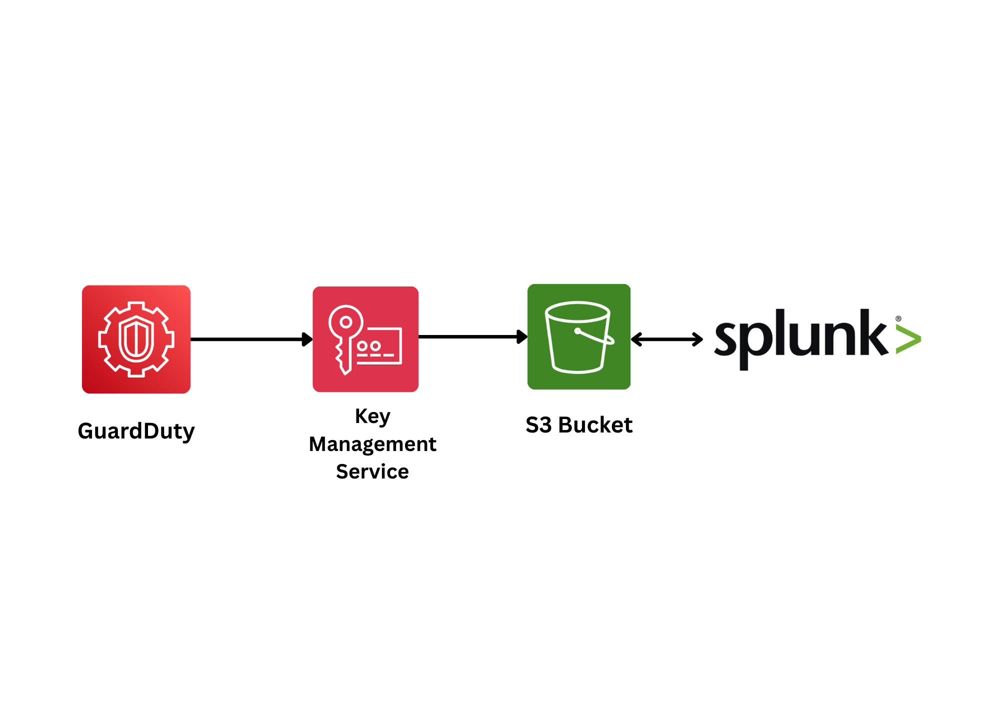

---

### KMS Configuration
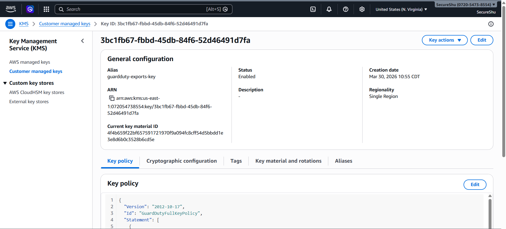
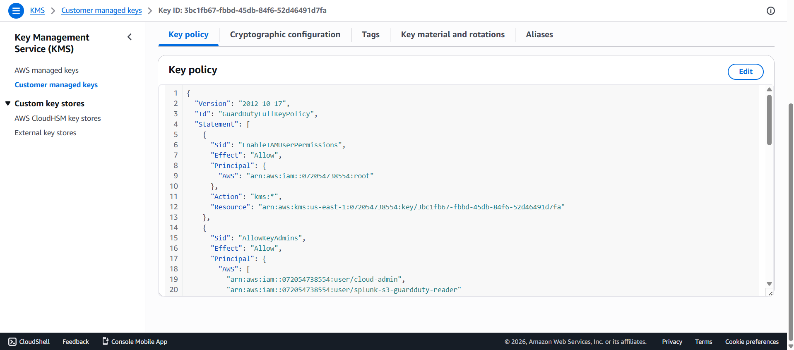

---

### S3 Bucket Setup
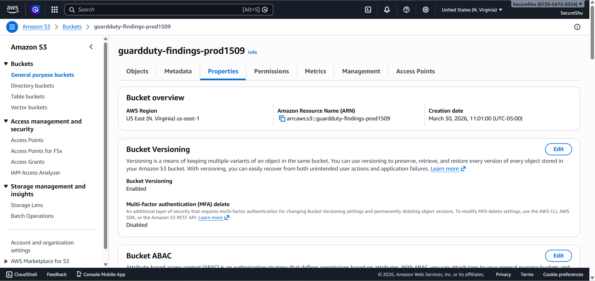
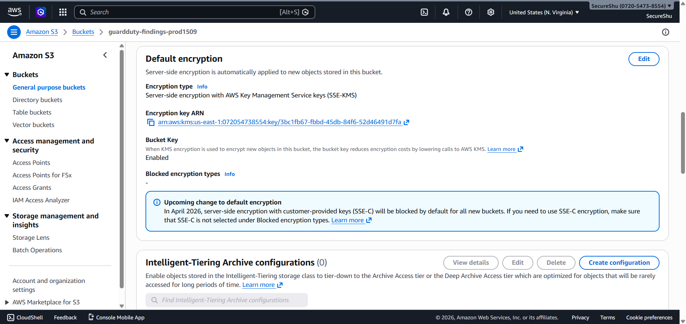
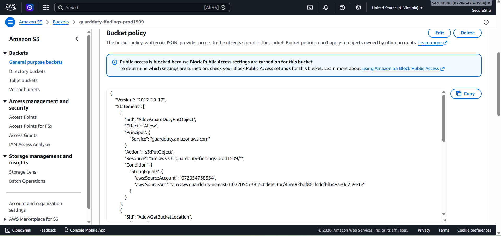

---

### IAM Configuration
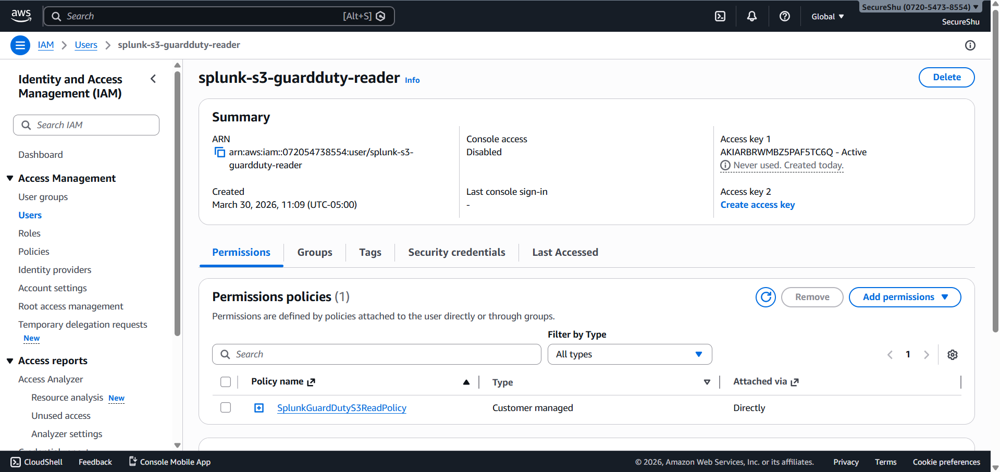

---

### GuardDuty Configuration
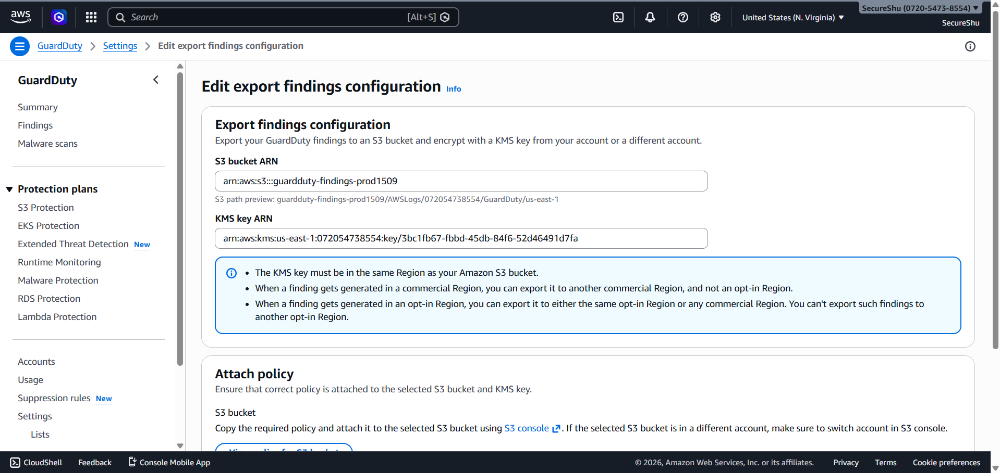
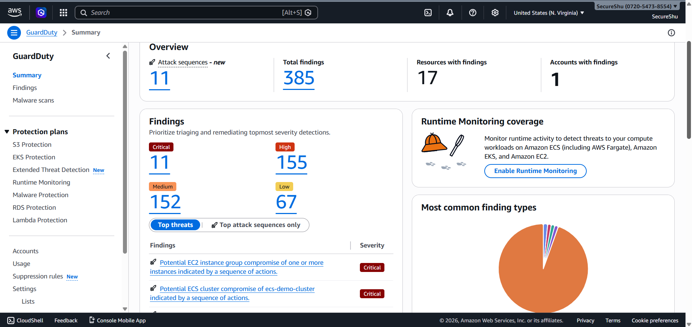

---

### Splunk Analysis
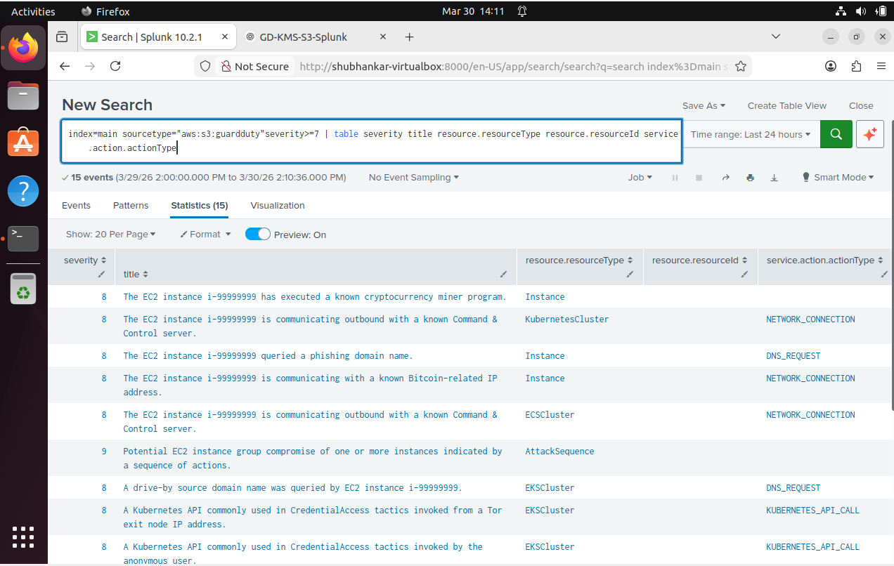
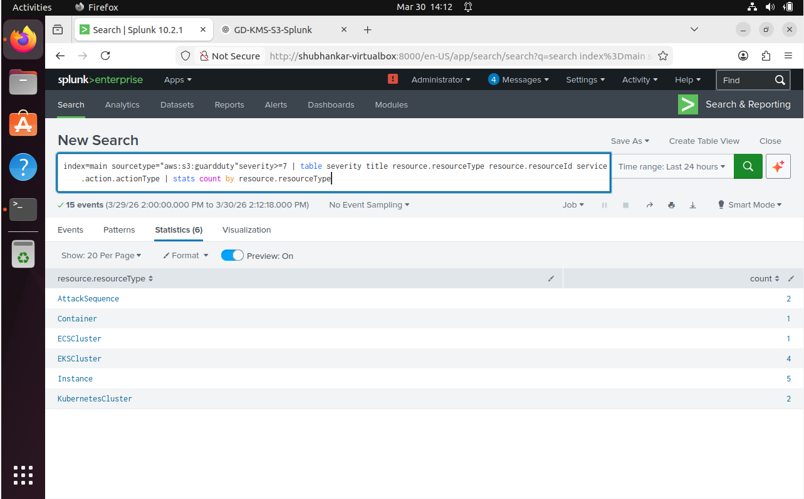
